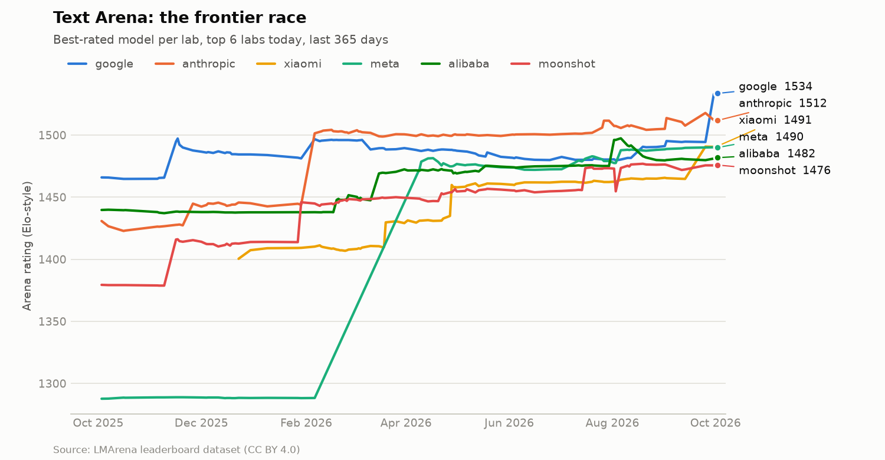
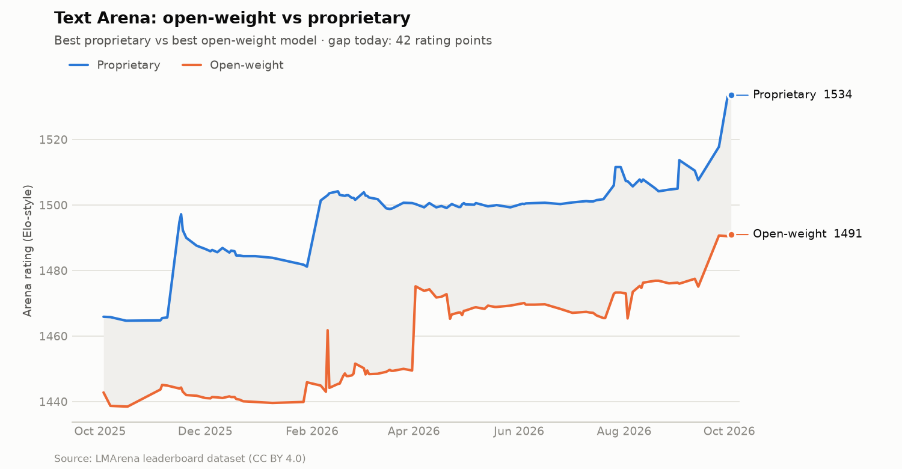
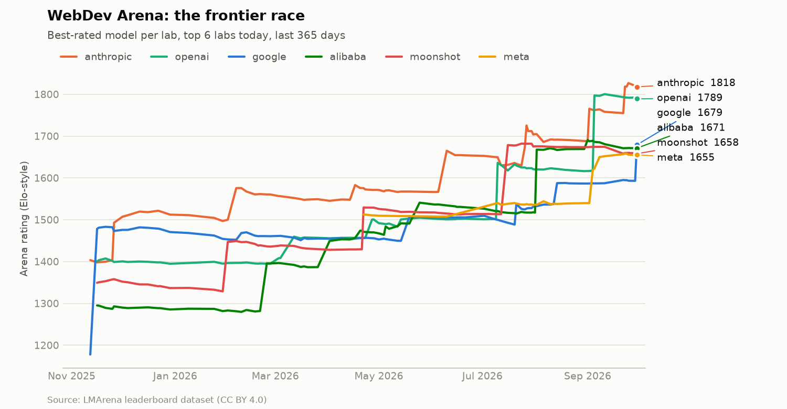
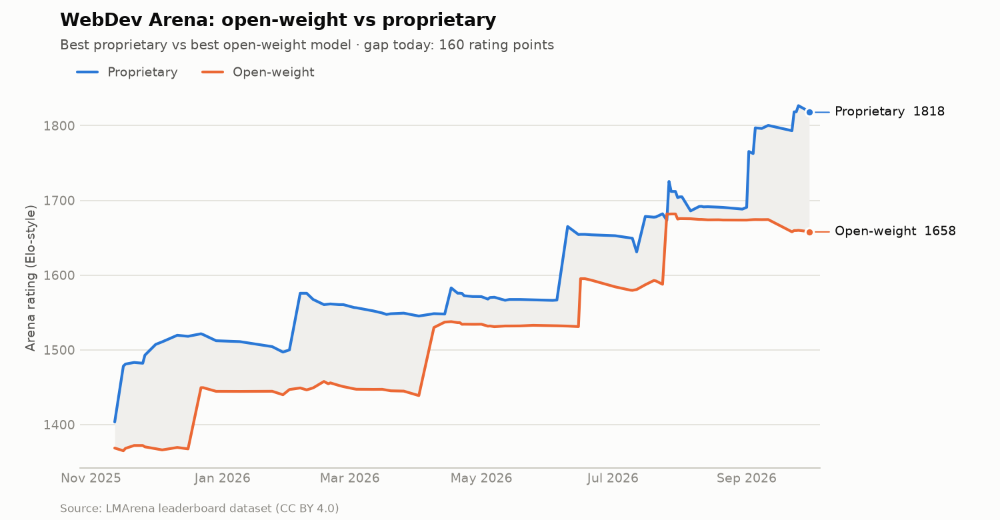
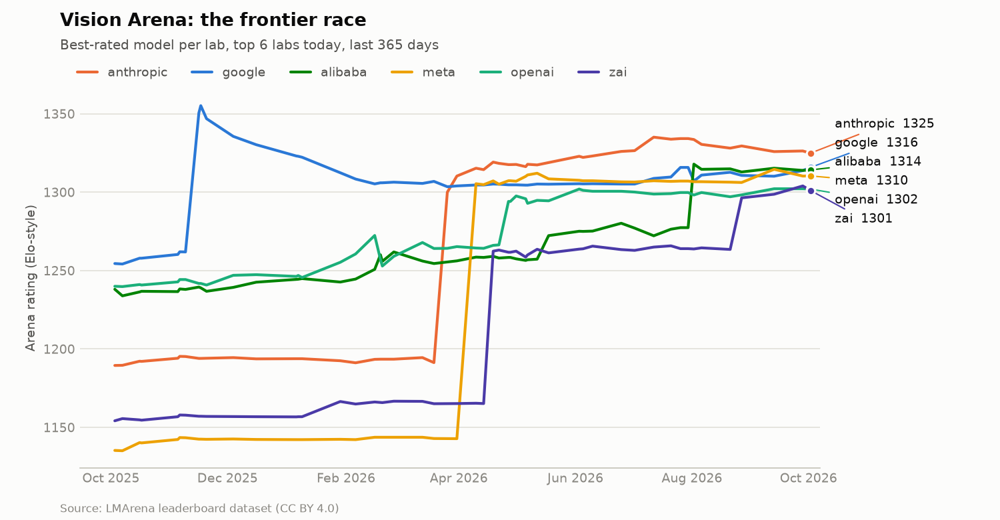
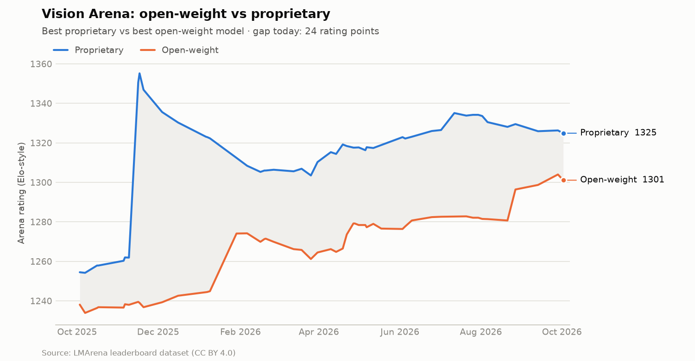

# LLM Leaderboard Tracker

A self-updating record of how large language models rank against each other over time. Every week a GitHub Actions workflow pulls the official [LMArena](https://lmarena.ai) leaderboard dataset, appends any new snapshots to a CSV history, redraws the trend charts, and refreshes the tables below.

Two questions it answers at a glance:

- **Who is winning the frontier race?** The best-rated model from each of the top labs, tracked week by week.
- **How close is open-weight to proprietary?** The best open-weight model against the best proprietary model, and the size of the gap between them.

## Latest standings

<!-- LEADERBOARD_START -->
_Tracked history: Text: 165 snapshots · WebDev: 93 snapshots · Vision: 113 snapshots_

### Text Arena

Leaderboard published 2026-10-02 · change vs 2026-09-25.

| # | Δ | Model | Lab | License | Rating | 95% CI | Votes |
|--:|:-:|-------|-----|---------|-------:|:------:|------:|
| 1 | 🆕 | `gemini-4-argon-high` | google | Proprietary | 1534 | 1525–1542 | 4,932 |
| 2 | ▼1 | `claude-opus-5.5-high` | anthropic | Proprietary | 1512 | 1503–1521 | 4,552 |
| 3 | ▼1 | `claude-fable-5.1-max` | anthropic | Proprietary | 1511 | 1504–1517 | 11,800 |
| 4 | ▼1 | `claude-opus-5-max` | anthropic | Proprietary | 1507 | 1502–1512 | 28,937 |
| 5 | ▼1 | `claude-opus-4-6-high` | anthropic | Proprietary | 1503 | 1500–1507 | 77,636 |
| 6 | ▼1 | `claude-opus-5-high` | anthropic | Proprietary | 1502 | 1498–1506 | 59,482 |
| 7 | ▼1 | `claude-opus-4-6` | anthropic | Proprietary | 1498 | 1494–1501 | 82,189 |
| 8 | ▼1 | `gemini-3.8-flash-high` | google | Proprietary | 1497 | 1492–1502 | 26,298 |
| 9 | ▼1 | `claude-fable-5-high` | anthropic | Proprietary | 1492 | 1487–1496 | 38,387 |
| 10 | ▼1 | `mimo-v2.6-pro` | xiaomi | Open (MIT) | 1491 | 1482–1500 | 4,056 |

Best open-weight model: `mimo-v2.6-pro` (xiaomi, MIT) at #10 with 1491.

<picture><source media="(prefers-color-scheme: dark)" srcset="charts/text-frontier-dark.png"></picture>

<picture><source media="(prefers-color-scheme: dark)" srcset="charts/text-open-vs-proprietary-dark.png"></picture>

### WebDev Arena

Leaderboard published 2026-10-01 · change vs 2026-09-24.

| # | Δ | Model | Lab | License | Rating | 95% CI | Votes |
|--:|:-:|-------|-----|---------|-------:|:------:|------:|
| 1 | = | `claude-opus-5.5-max` | anthropic | Proprietary | 1815 | 1799–1831 | 2,062 |
| 2 | = | `gpt-6-astra-max` | openai | Proprietary | 1788 | 1777–1798 | 6,123 |
| 3 | 🆕 | `claude-sonnet-5.5-xhigh` | anthropic | Proprietary | 1786 | 1768–1804 | 1,531 |
| 4 | 🆕 | `gpt-6.1-sol-max` | openai | Proprietary | 1758 | 1741–1775 | 1,620 |
| 5 | ▼2 | `claude-fable-5.1-max` | anthropic | Proprietary | 1749 | 1740–1759 | 6,318 |
| 6 | 🆕 | `claude-sonnet-5.5-high` | anthropic | Proprietary | 1715 | 1702–1729 | 2,527 |
| 7 | ▼3 | `claude-opus-5-max` | anthropic | Proprietary | 1695 | 1688–1702 | 16,954 |
| 8 | ▼3 | `gpt-6-sol-max` | openai | Proprietary | 1689 | 1678–1700 | 3,411 |
| 9 | 🆕 | `gemini-4-argon-high` | google | Proprietary | 1680 | 1666–1693 | 2,422 |
| 10 | ▼4 | `qwen3.8-max` | alibaba | Proprietary | 1671 | 1659–1683 | 3,454 |

Best open-weight model: `kimi-k3-max` (moonshot, Kimi K3 license) at #13 with 1658.

<picture><source media="(prefers-color-scheme: dark)" srcset="charts/webdev-frontier-dark.png"></picture>

<picture><source media="(prefers-color-scheme: dark)" srcset="charts/webdev-open-vs-proprietary-dark.png"></picture>

### Vision Arena

Leaderboard published 2026-10-02 · change vs 2026-09-13.

| # | Δ | Model | Lab | License | Rating | 95% CI | Votes |
|--:|:-:|-------|-----|---------|-------:|:------:|------:|
| 1 | 🆕 | `claude-fable-5-high` | anthropic | Proprietary | 1325 | 1318–1332 | 13,709 |
| 2 | ▲1 | `claude-opus-5-high` | anthropic | Proprietary | 1321 | 1314–1328 | 15,900 |
| 3 | ▼1 | `claude-fable-5.1-max` | anthropic | Proprietary | 1320 | 1310–1330 | 4,312 |
| 4 | = | `claude-opus-4-7` | anthropic | Proprietary | 1316 | 1310–1323 | 23,169 |
| 5 | 🆕 | `gemini-3.8-flash-high` | google | Proprietary | 1316 | 1304–1327 | 3,086 |
| 6 | ▲1 | `claude-opus-4-6-high` | anthropic | Proprietary | 1316 | 1309–1322 | 22,328 |
| 7 | 🆕 | `gemini-3.7-flash-high` | google | Proprietary | 1315 | 1305–1325 | 3,814 |
| 8 | ▼2 | `qwen3.8-max` | alibaba | Proprietary | 1314 | 1307–1322 | 10,040 |
| 9 | = | `claude-opus-4-6` | anthropic | Proprietary | 1313 | 1307–1319 | 26,869 |
| 10 | ▼5 | `claude-opus-4-7-high` | anthropic | Proprietary | 1313 | 1306–1320 | 22,755 |

Best open-weight model: `glm-5.3-flash` (zai, MIT) at #18 with 1301.

<picture><source media="(prefers-color-scheme: dark)" srcset="charts/vision-frontier-dark.png"></picture>

<picture><source media="(prefers-color-scheme: dark)" srcset="charts/vision-open-vs-proprietary-dark.png"></picture>

<!-- LEADERBOARD_END -->

## How it works

```
LMArena dataset (Hugging Face) ──► normalize + filter ──► data/<arena>.csv ──► charts/*.png + README
```

1. **Fetch.** Downloads the `full` split of [`lmarena-ai/leaderboard-dataset`](https://huggingface.co/datasets/lmarena-ai/leaderboard-dataset) for each tracked arena (Text, WebDev, Vision).
2. **Normalize.** Keeps the `overall` category and the top 150 models of each snapshot, and maps the slightly different column names used by different arenas onto one schema.
3. **Merge.** Adds only snapshots that are not in the CSV yet. Because the whole history is checked every run, a missed week fills itself in.
4. **Render.** Draws two charts per arena, each in a light and a dark version (GitHub shows the one matching your theme).
5. **Publish.** Rewrites the section above. If LMArena published nothing new, no file changes and no commit is made.

## Data

| File | Contents |
|------|----------|
| `data/text.csv`, `data/webdev.csv`, `data/vision.csv` | `date, model, organization, license, rating, rating_lower, rating_upper, votes, rank` |
| `charts/<arena>-frontier.png` | Best rating per lab over the last 12 months |
| `charts/<arena>-open-vs-proprietary.png` | Best open-weight vs best proprietary model |

**Open-weight** means any license other than `Proprietary` in the dataset (Apache 2.0, MIT, Llama, Modified MIT, and similar). **Rating** is LMArena's Elo-style score from human preference votes, with a 95% confidence interval. Models whose intervals overlap are statistically tied.

The CSVs are plain files, so you can load them straight into pandas:

```python
import pandas as pd
df = pd.read_csv("https://raw.githubusercontent.com/arielshakaramiro/llm-leaderboard-tracker/main/data/text.csv")
```

### Why not the Hugging Face Open LLM Leaderboard?

It was retired by Hugging Face in 2025 and its results are archived, so there is no new data to track. LMArena is the actively maintained leaderboard with an official, versioned dataset.

## Run it yourself

```bash
pip install -r requirements.txt
python tracker.py
```

Requires Python 3.10+. No API keys needed, the dataset is public.

## Customize

Edit `config.json`:

- `arenas`: which arenas to track. Other available ones include `search`, `document`, `text_to_image`, `image_edit`, `text_to_video`, and `agent`.
- `history_start`: how far back the CSV history goes.
- `chart_days`: the time window shown in the charts.
- `frontier_orgs`: how many labs appear in the frontier chart.
- `org_colors`: a fixed color slot (1–8) per lab, so a lab keeps the same color across every chart and every week.

## License

Code: MIT. Leaderboard data: © LMArena, distributed under [CC BY 4.0](https://creativecommons.org/licenses/by/4.0/) via the [Arena leaderboard dataset](https://huggingface.co/datasets/lmarena-ai/leaderboard-dataset).
